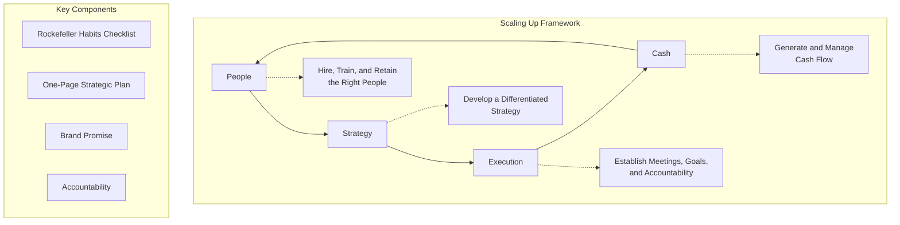
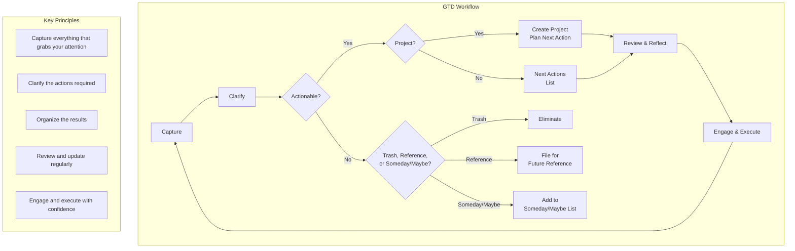
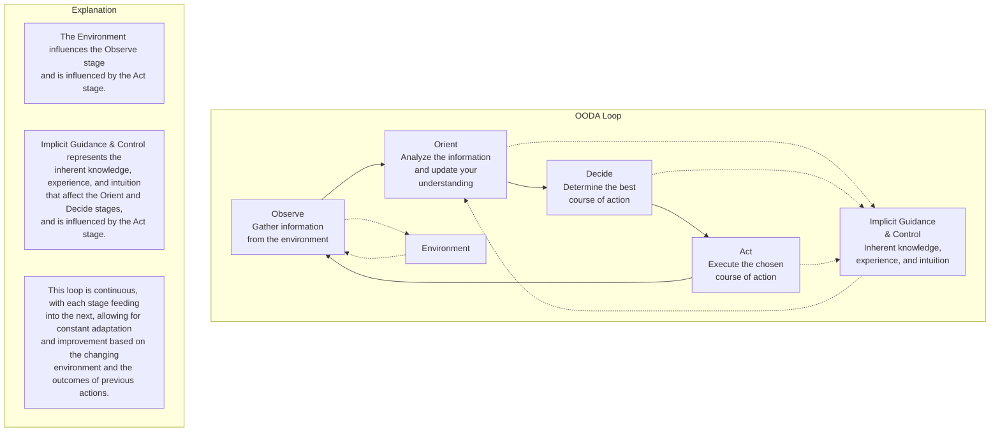
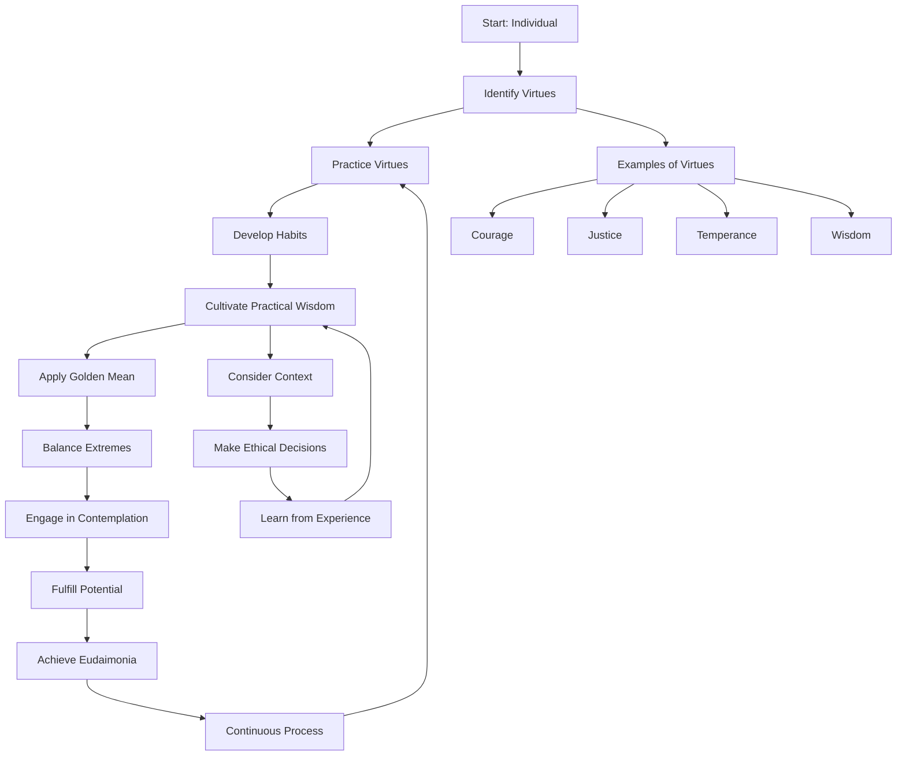

# hello-ghaction-workflows
playing with gh actions

https://docs.github.com/en/actions

# mermaid

## scaling up

```mermaid
graph TD
  subgraph Scaling Up Framework
    P[People] --> S[Strategy]
    S --> E[Execution]
    E --> C[Cash]
    C --> P
    
    P -.-> H[Hire, Train, and Retain<br>the Right People]
    S -.-> D[Develop a Differentiated<br>Strategy]
    E -.-> M[Establish Meetings, Goals,<br>and Accountability]
    C -.-> F[Generate and Manage<br>Cash Flow]
  end

  subgraph Key Components
    R[Rockefeller Habits Checklist]
    O[One-Page Strategic Plan]
    B[Brand Promise]
    A[Accountability]
  end
```

## gtd

```mermaid
graph TD
  subgraph GTD Workflow
    C[Capture] --> Cl[Clarify]
    Cl --> A{Actionable?}
    A -->|Yes| P{Project?}
    P -->|Yes| Pr[Create Project<br>Plan Next Action]
    P -->|No| N[Next Actions<br>List]
    A -->|No| T{Trash, Reference,<br>or Someday/Maybe?}
    T -->|Trash| Tr[Eliminate]
    T -->|Reference| F[File for<br>Future Reference]
    T -->|Someday/Maybe| S[Add to<br>Someday/Maybe List]
    Pr --> R[Review & Reflect]
    N --> R
    R --> E[Engage & Execute]
    E --> C
  end

  subgraph Key Principles
    K1[Capture everything that grabs your attention]
    K2[Clarify the actions required]
    K3[Organize the results]
    K4[Review and update regularly]
    K5[Engage and execute with confidence]
  end
```

## ooda loop

```mermaid
graph TD
  subgraph OODA Loop
    O[Observe<br>Gather information<br>from the environment] --> OO[Orient<br>Analyze the information<br>and update your<br>understanding]
    OO --> D[Decide<br>Determine the best<br>course of action]
    D --> A[Act<br>Execute the chosen<br>course of action]
    A --> O
    
    O -.-> E[Environment]
    E -.-> O
    OO -.-> I[Implicit Guidance<br>& Control<br>Inherent knowledge,<br>experience, and intuition]
    I -.-> OO
    D -.-> I
    A -.-> I
  end
  
  subgraph Explanation
    EX1[The Environment influences the Observe stage<br>and is influenced by the Act stage.]
    EX2[Implicit Guidance & Control represents the<br>inherent knowledge, experience, and intuition<br>that affect the Orient and Decide stages,<br>and is influenced by the Act stage.]
    EX3[This loop is continuous, with each stage feeding<br>into the next, allowing for constant adaptation<br>and improvement based on the changing<br>environment and the outcomes of previous actions.]
  end
```

# nichomachean ethics 

```mermaid
graph TD
    A[Start: Individual] --> B[Identify Virtues]
    B --> C[Practice Virtues]
    C --> D[Develop Habits]
    D --> E[Cultivate Practical Wisdom]
    E --> F[Apply Golden Mean]
    F --> G[Balance Extremes]
    G --> H[Engage in Contemplation]
    H --> I[Fulfill Potential]
    I --> J[Achieve Eudaimonia]
    
    B --> K[Examples of Virtues]
    K --> L[Courage]
    K --> M[Justice]
    K --> N[Temperance]
    K --> O[Wisdom]
    
    E --> P[Consider Context]
    P --> Q[Make Ethical Decisions]
    Q --> R[Learn from Experience]
    R --> E
    
    J --> S[Continuous Process]
    S --> C
```
